# Frontend Developer Test

## Getting Started

### Requirements

- node: version 16 (v16.13.1)
- npm: version 8 (8.1.2)

### Running

#### Environment Set-up

- Copy the content of `.env.dist` into `.env`
- Have your AWS/S3 data set accordingly.

#### Project Set-up

```sh
cd <project-dir>
npm install
```

### Project Running

```sh
npm start
```

### Photo album, Uploader, Authentication UX all in one! 🎉🎉🎉

Having the urge to make something cool, I ended up making a sophisticated online gallery, with a minimalist welcome screen to give our users better a11y.

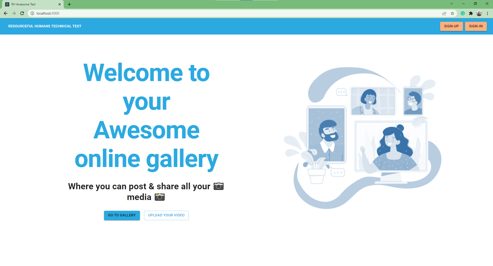

As an unauthorized user, you can either go Sign-up, Sign-in, or visit the public gallery. But don't fall for the upload video button, it's made to bait you into a clumsy un-authorization scree 🙈

Let's roll into action, as a non registered user running this project, you can sign-in with the most encrypted credentials ever:

```sh
 email: admin
 password: admin
```

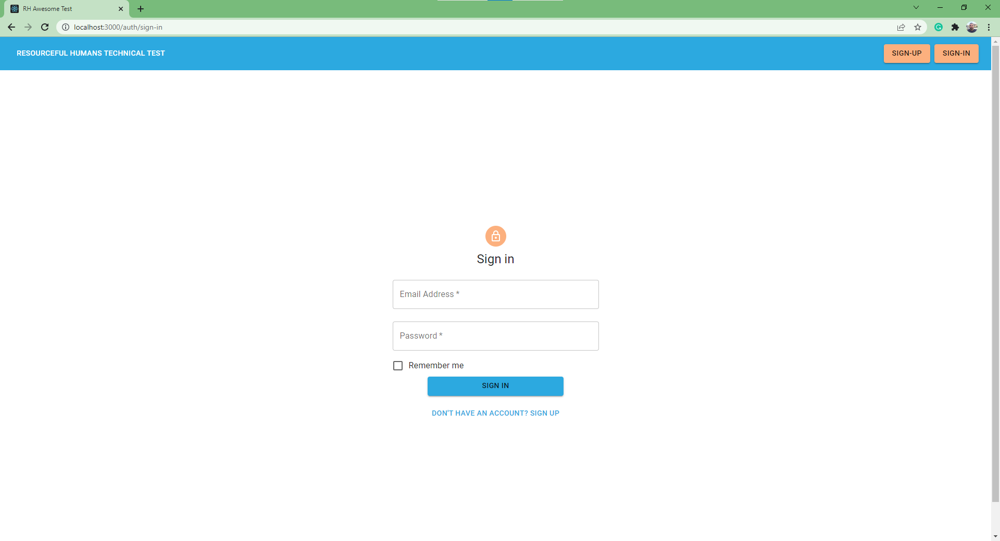

Or if you hate the easy way, go make your own user
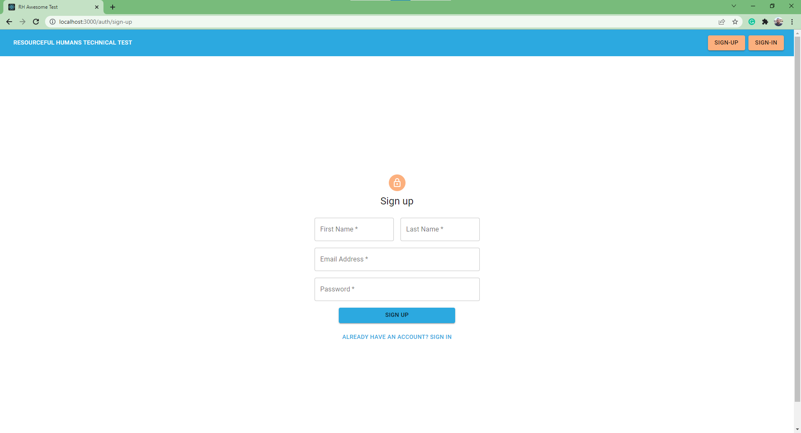

Either way, you will end up with this awesome view 🤩


The gallery is responsive is requested, but with two extra-features

- copy: Copy the photo link to the clip-board, so you can CTRL+V it anywhere else
- like: A Trick to memorize your most favorite <s>cat</s> placeholder pictures

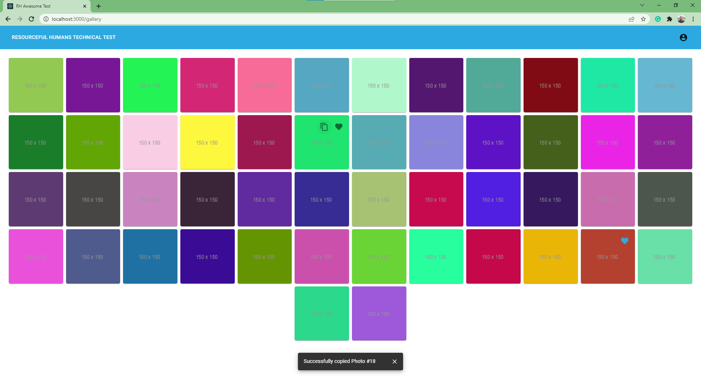 | 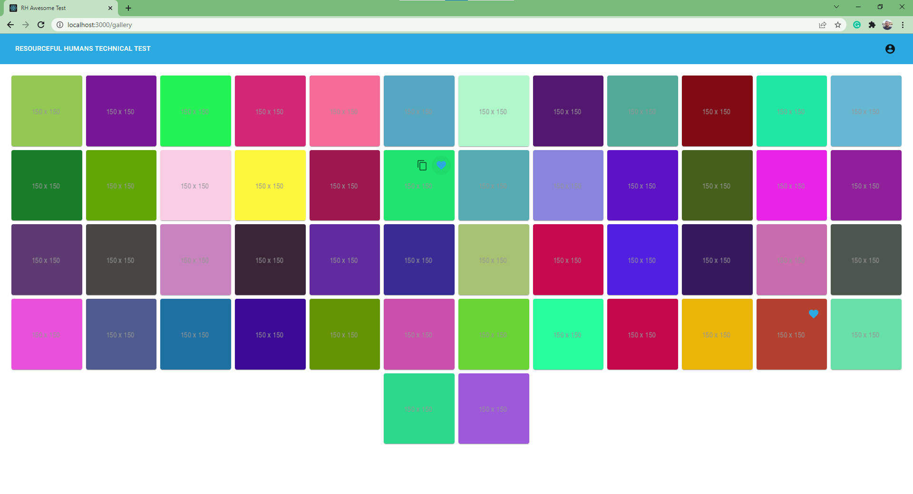

Clicking on any picture, or pasting its url in the browser will always lead you to preview its content in the preview page

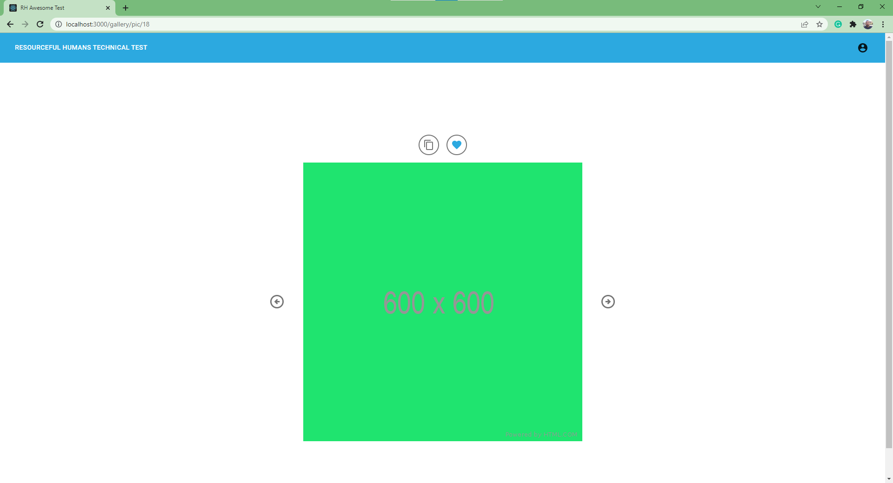

Where of course you can move left, or as it is demonstrated within this picture, to the right
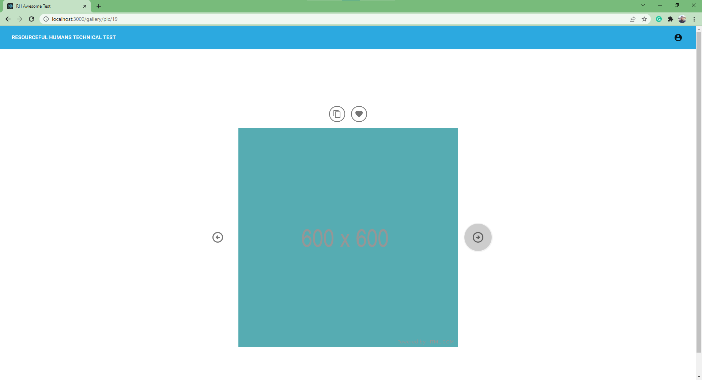

Once you're done exploring the images of the 50 colors pictures, and you've found out that:

- you can't move next on the 50th picture
- nor move previous in the first one

now it's time to move to a more lovely part of the app, the MySpace part 🚀🎉

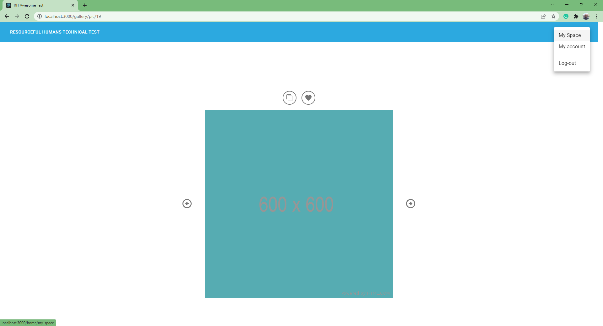

MySpace designate the page where the uploader lays down, You will see some videos I've already submitted on AWS/S3 Bucket, _(if you will use my aws credentials of course)_

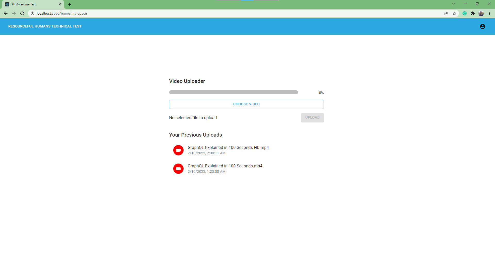

Pressing the Choose video button will get you the browser-file-explorer to select your desired video, which we praise you to select anything under 50MB 🙏

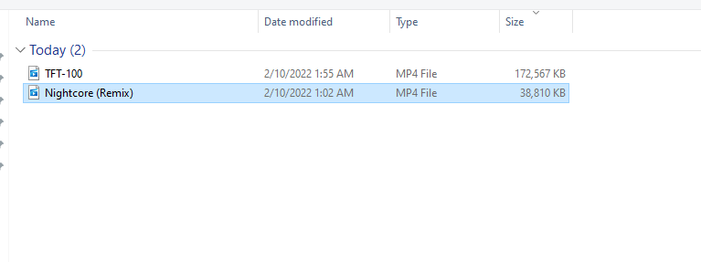

For example, uploading NightCore (Remix) _(yeah, just another weeb)_, will be a successful since it's less than 50MB
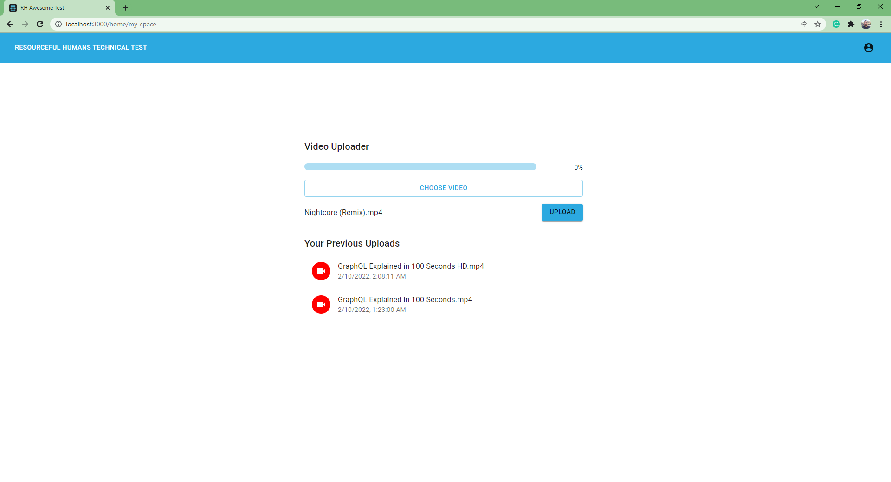

For the normal process, we can look at the awesome progress par loading as the S3 Client updates us with the overall upload progress, awesome isn't it 🎈🎈
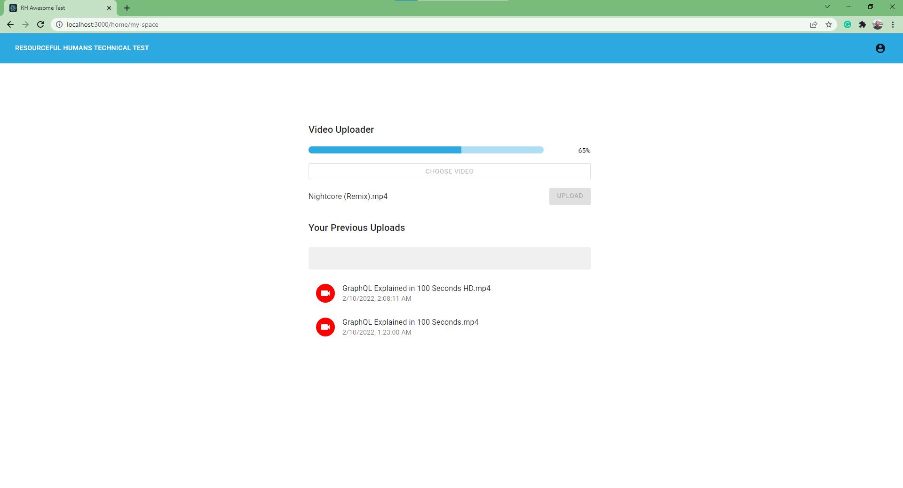

Once done, it gets added to the list to replace the Skeleton placeholder
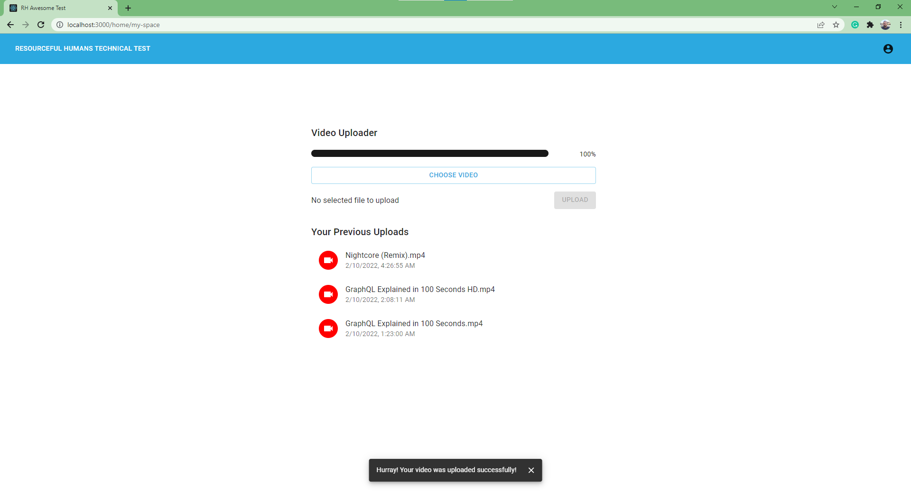

And there it lies, in the S3 Bucket, alongside his buddies
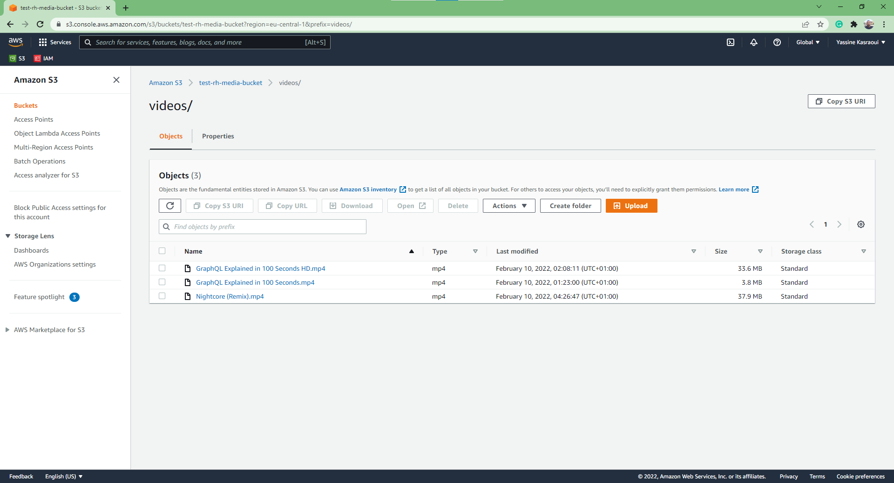

Trying to upload anything heavier than 50MB however, will result into an error message,
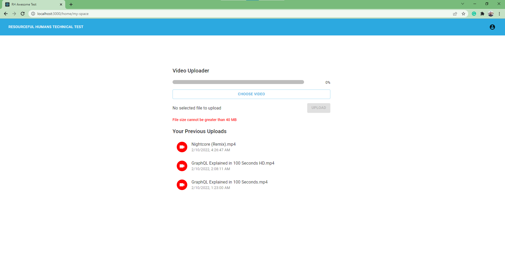

And yeah, about the authorization, unfortunately, our non-authorized users will get this instead of the awesome uploader.
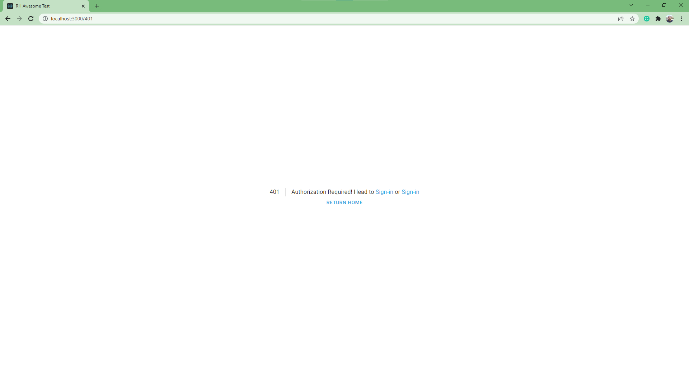

and also, trying to reach something not stated as a route for our application, will give you this
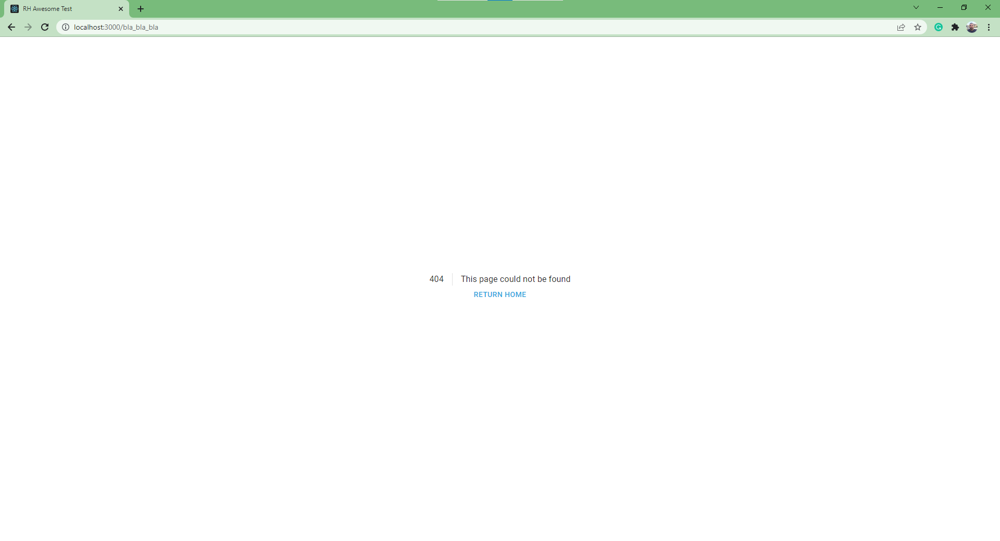

This short tour, is about to finish, time to get you a quick hint before you dive deeper into the code,
here is the overall project architecture
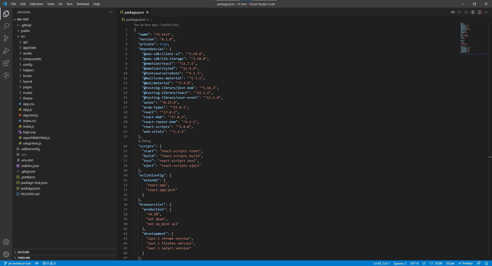

For the used Libraries, I have used:

- @aws-sdk/client-s3 **version:3.50.0** and @aws-sdk/lib-storage **version:3.50.0**
  - official sdks for AWS Clients and S3 communication
- @mui/material **version:5.4.0**

  - Material UI React Implementation, cool UI Component Framework with a handy number of components ready to be made, with version 5, it gets even more customizable, making it easier to develop component and have them updated according to your specific needs.
    Mater Ui Requires some associate libs, such as - @emotion/react **version:11.7.1** - @emotion/styled **version:11.6.0** - @fontsource/roboto **version:4.5.3** - @mui/icons-material **version:5.3.1**

- create-react-app **version:5.16.2** (INSTALLED GLOBALLY)

  - Bringing various things to the app, unfortunately couldn't make it to develop Testing utilities within this project.

- axios **version:0.25.0**

  - a good api tool, it comes with great use when using proxies, but for this project, it was a real easier to use than having to handle the response of the fetch api.

- eslint **version:7.32.0** for linting, used to maintain a good quality code.
- prettier **version:2.5.1** for formatting, used to maintain a better code readability

everything lays within the src

- api: used to mock the authentication process
- appState: holding the ContextAPI based state management of the app
  - Auth: for the user state, its data, sign-in/sign-up/sign-out actions
  - gallery: for the picture list handling, moving next and previous according to the current Index of the image
  - likedList: for the likedImages handling
  - snackbar: for the utility of alert feedback
- assets: place of our static media
- components: for React specific components
- config: for global app configuration
- helpers: for the possible utility no-scope functions
- hooks: for React hooks, essentially for the use of context
- layout: for Page englobing component
- pages: for each displayable page of the app
- routes: for the app routing system
- theme: for the design 💄

## Submitting my answer

1. Checkout this repository ✅
2. Make a new branch for your work ✅
3. Submit a pull request with your submission ✅
4. Email us a link to the pull request ✅

## Tips

- Automated tests are fundamental to successful software projects (we expect to see some) ☠️☠️☠️☠️
- Using libraries, frameworks, and copied examples is fine, but you will be expected to explain your choices. So if in doubt, it may for example, be better to use your own implementation than using a library you do not fully understand. 🤩🤩🤩🤩
- Linting and other checks are up to you 🤩🤩
